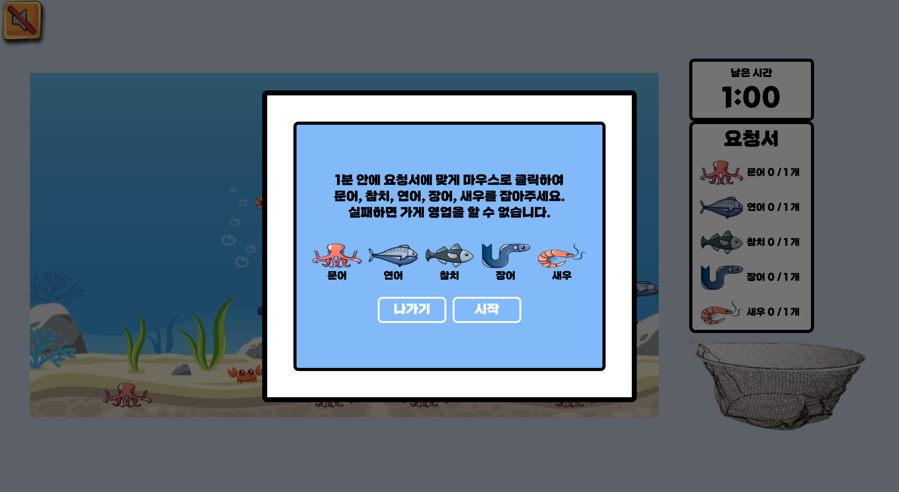

# 🍣 위대한 초밥 Great Sushi

<p style="text-align: center;">
  
</p>

> 배포 사이트 [https://greatsushi.fun](https://greatsushi.fun)

<br>

## 🚘 목차
- ✏️ [기획 동기](#기획-동기)
- ⚙️ [기술 스택](#기술-스택)
- 🪄 [사용법](#사용법)
- 🎮 [프로젝트 설명](#프로젝트-설명)
   - 🎣 [낚시](#낚시)
   - 👩‍🍳 [초밥 만들기](#초밥-만들기)
- 🗓 [작업 기간](#작업-기간)
- 🧩 [배움](#배움)

<br>

## ✏️ 기획 동기
어릴적 즐겨 했던 슈의 라면게임, 고향만두와 같은 플래쉬 게임을 Canvas로 만들어 보고 싶었습니다.

<br>

## ⚙️ 기술 스택
- React
- Redux
- styled-components
- Canvas
- immer
- Jest

<br>

## 🪄 사용법
```
git clone https://github.com/great-sushi/great-sushi.git
npm install
npm start
```
- `Repository` 를 `clone` 해주세요.
- `npm install` 로 패키지를 설치해주세요.
- 터미널엣 `npm start` 로 실행하면, `http://localhost:3000`에서 위대한초밥을 확인할 수 있습니다.

<br>

## 🎮 프로젝트 설명

### 🎣 낚시
<p style="text-align: center;">
  
</p>
📌 게임시작 버튼을 누를 시, 낚시 게임 가이드를 확인할 수 있습니다.

<br><p style="text-align: center;">
  
</p>
📌  1분 안에 우측 랜덤 요청서에 따라 재료를 준비해야합니다.
<br>📌  마우스 움직임에 따라 낚시줄이 이동합니다.
<br>📌  움직이는 물고기를 클릭하면 낚을 수 있습니다.

### <br>👩‍🍳 초밥 만들기
<p style="text-align: center;">
  
</p>
📌  낚시 게임에서 성공하면, 초밥 가게를 개점할 수 있습니다.
<br>📌  초밥의 종류와 가격, 게임 방법을 가이드에서 확인할 수 있습니다.
<br>📌  손님은 총 6종의 초밥중 하나를 주문하게 됩니다.
<br>📌 고추냉이 양은 0 ~ 100% 범위 안에서 요청합니다.

<br><p style="text-align: center;">
  
</p>

📌  사용자는 초밥 만들기 순서를 지켜야 합니다. ( 밥 → 고추냉이 → 회 )
<br>📌  순서를 지키지 않으면 접시에 드랍할 수 없습니다.
<br>📌  손님의 주문대로 초밥을 만들지 않는다면 수익금이 깎입니다.
<br>📌  고추냉이를 요청보다 많거나 적게 올리면, 해당 초밥 가격의 반이 수익금에서 깎입니다.
<br>📌  요청과 다른 초밥을 만들면, 1000원이 수익금에서 깎이게 됩니다.

<br>

## 🗓 작업 기간
### **1주차**
✔️ **아이디어 브레인스토밍** : ( 5월3일-4일 )
<br>✔️ **기획**: ( 5월5일 )
<br>✔️ **Task, Mock up 작성**: ( 5월6일 )
<br>✔️ **이미지 제작**

### **2주차**
✔️ **구조와 기능 구현**: ( 5월7일-15일 )

### **3주차**
✔️ **스타일**: ( 5월16일-21일 )

<br>

## 🧩 배움
### **Canvas anti-aliasing (캔버스 계단 현상 방지)**

<br>

<p style="text-align: center;">
  
</p>

> 계단 현상 예시

- Canvas로 구현한 움직이는 물고기, 손님 이미지, 레일에 계단 현상이 나타났습니다.
- 사용자에게 선명한 이미지와 그림을 보여주기 위하여 반드시 해결해야하는 문제였습니다.
- 계단 현상은 css 1px을 그리는 데 사용되는 물리적인 픽셀 수가 디스플레이마다 다르기 때문에 발생한다는 것을 알게 되었습니다.


<br><p style="text-align: center;">
  
</p>

> 계단 현상 방지 예시

- 초기 설정된 캔버스는 높은 해상도를 가지는 디스플레이에서 기존 이미지를 확대하는 방식으로 누락된 픽셀 수에 대응하려고 하기 때문에 `aliasing`이 발생할 수 있다는 것이었습니다.
- 이를 보정하여 선명한 그림을 보여주기 위해서 Canvas의 크기에 레티나 디스플레이의 `devicePixelRatio` 만큼 크게 보정해주었고, 새로운 Canvas 크기를 고려하여 그려질 수 있도록 scale 조정을 해주었습니다.
- 이렇게 되면 화면에 `2배` 큰 캔버스에 그림이 그려진 모습이 보이는데, Canvas의 css 요소 넓이와 높이를 초기 Canvas 크기로 설정하여 기존 크기에서 선명한 이미지를 보여줄 수 있게 하였습니다.
