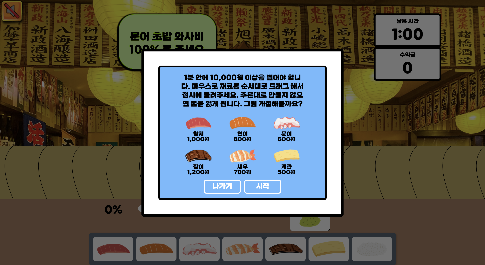

# 위대한 초밥

  

## 목차
- [기획 동기](#기획-동기)
- [기술 스택](#기술-스택)
- [프로젝트 설명](#프로젝트-설명)
   - [낚시](#낚시)
   - [초밥 만들기](#초밥-만들기)
- [작업 기간](작업-기간)

 

## 기획 동기
어릴적 즐겨 했던 슈의 라면게임, 고향만두와 같은 플래쉬 게임을 Canvas로 만들어 보고 싶었습니다.

 

## 기술 스택
- React
- Redux
- styled-components
- Canvas
- immer

 

## 프로젝트 설명

### 낚시

  

📌 게임시작 버튼을 누를 시, 낚시 게임 가이드를 확인할 수 있습니다.

 

  

📌  1분 안에 우측 랜덤 요청서에 따라 재료를 준비해야합니다.
 📌  마우스 움직임에 따라 낚시줄이 이동합니다.
 📌  움직이는 물고기를 클릭하면 낚을 수 있습니다.

 

### 초밥 만들기

  

 📌  낚시 게임에서 성공하면, 초밥 가게를 개점할 수 있습니다.
 📌  초밥의 종류와 가격, 게임 방법을 가이드에서 확인할 수 있습니다.
 📌  손님은 총 6종의 초밥중 하나를 주문하게 됩니다.
 📌 고추냉이 양은 0 ~ 100% 범위 안에서 요청합니다.

  

 📌  사용자는 초밥 만들기 순서를 지켜야 합니다. ( 밥 → 고추냉이 → 회 )
 📌  순서를 지키지 않으면 접시에 드랍할 수 없습니다.
 📌  손님의 주문대로 초밥을 만들지 않는다면 수익금이 깎입니다.
 📌  고추냉이를 요청보다 많거나 적게 올리면, 해당 초밥 가격의 반이 수익금에서 깎입니다.
 📌  요청과 다른 초밥을 만들면, 1000원이 수익금에서 깎이게 됩니다.

 

## 작업 기간
### **1주차**
✔️ **아이디어 브레인스토밍** : ( 5월3일-4일 )
 ✔️ **기획**: ( 5월5일 )
 ✔️ **Task, Mock up 작성**: ( 5월6일 )
 ✔️ **이미지 제작**

### **2주차**
✔️ **구조와 기능 구현**: ( 5월7일-15일 )

### **3주차**
✔️ **스타일**: ( 5월16일-21일 )
